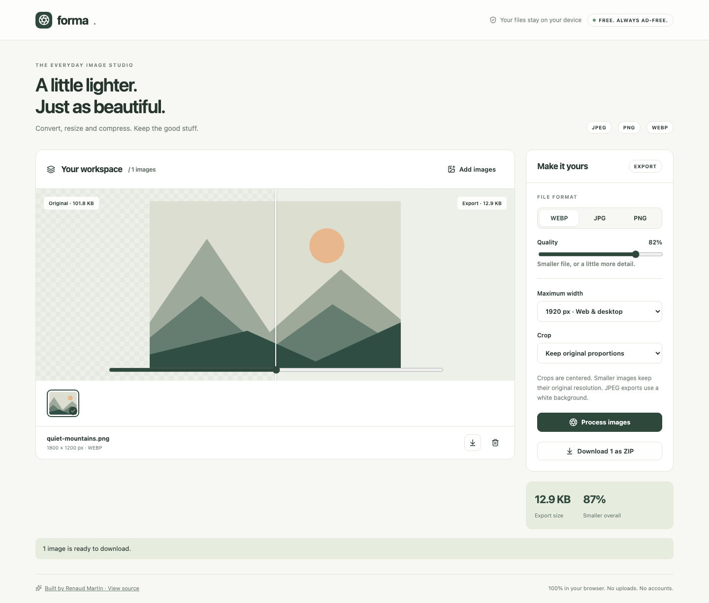

# Forma

A private image studio for everyday work.

[Live app](https://rjamartin.github.io/image-studio/) · [Design & engineering case study](docs/CASE_STUDY.md)



## Features

- Batch JPEG, PNG and WebP conversion
- Centered square, landscape and wide crops
- Resize presets without upscaling
- Adjustable lossy quality and before/after comparison
- Individual downloads and batch ZIP export
- Processing progress, cancellation between files, and file validation

## Run locally

Node.js 22.12 or newer is required.

```sh
npm ci
npm run dev
```

```sh
npm test
npm run build
npm run preview
```

`npm run format` formats source and documentation. No API keys, database, backend or environment variables are needed.

## Deployment

This repository has a **Deploy to GitHub Pages** workflow. In repository **Settings → Pages**, select **GitHub Actions** as the source. In **Actions → Deploy to GitHub Pages**, choose **Run workflow** on `main`. The action installs the locked dependencies, tests and builds the app, then publishes `dist/`.

Publishing is manual so pushing work in progress does not immediately change the live portfolio. The relative Vite base supports both `/image-studio/` and a custom-domain root. A separate CI workflow runs tests and a production build on pushes and pull requests.

## Architecture

- `src/App.tsx`: application state and interactive UI
- `src/image.ts`: processing and export logic
- `src/ui.tsx`: UI helpers and downloads
- `src/styles.css`: responsive visual system
- `src/*.test.ts`: focused behavior tests

TypeScript handles browser APIs and file-processing boundaries. React handles the interactive workspace; Vite emits ordinary static files suitable for GitHub Pages.

## Privacy

All processing runs on the visitor's device. File contents are never uploaded. There are no analytics or third-party runtime requests. Hosting still receives ordinary page and asset requests.

## Limits

- 30 images per workspace; 20 MB and 40 megapixels per input.
- JPEG, PNG and WebP only. Animated images, HEIC, RAW and AVIF are outside this release.
- Quality depends on browser encoders. Metadata is not preserved, and a conversion does not always reduce file size.
- Cancellation takes effect between images. Files are held in memory and disappear when the tab closes.

## Verification

Geometry tests cover aspect ratios, centered crops and no upscaling. Browser verification covers sample import, conversion, ZIP download, and desktop/mobile layouts.

## Third-party software

React and React DOM (MIT); Vite (MIT); TypeScript (Apache-2.0); Lucide (ISC); JSZip (MIT). Dependency license notices remain with their packages and distribution output.

Built by [Renaud Martin](https://github.com/RJAMartin).
